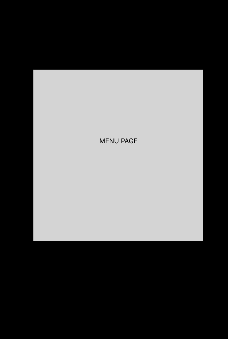
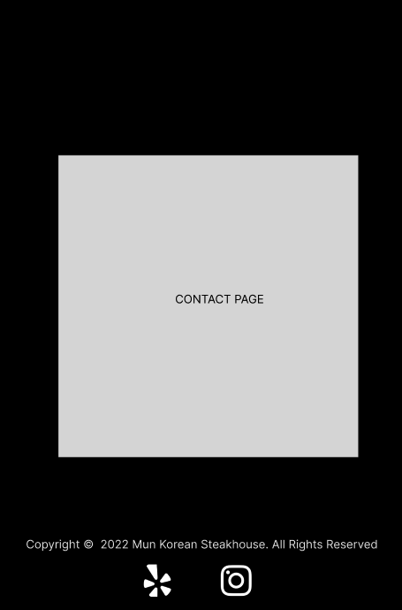

# Mun Korean Steakhouse
A website for Mun Korean Steakhouse

## Deployment Links
---
- Coming Soon

## Installation Instructions
---
- Coming Soon

## Planning Tools
---
* Figma

## Technology Used
---
* React
* Tailwind CSS

## A rough draft of the website layout
---

    
Click to see images

    

## MVP
---
- [X] Responsive Navbar
- [] About page explaining about Mun Korean Steakhouse.
- [] Menu page showcasing all of the different dishes the restaurant is offering.
- [] Contact page that shows the address, hours, socials and etc.

## Stretch Goals
---
- [] Implement Google Maps to the website.

## Resources
---
- Mun Korean Steakhouse Instagram Photos
- React Icons